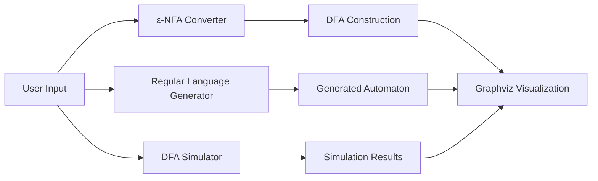

# Finite Automata Toolkit


> An educational toolkit for constructing, simulating, visualizing, and converting finite automata. The project combines multiple Theory of Computation concepts into an interactive Python application with Graphviz-based visualizations.

---

# Overview

Finite Automata Toolkit is designed to simplify learning and experimenting with finite-state machines. It provides utilities for creating deterministic finite automata (DFA), converting ε-NFAs to DFAs, generating automata from regular language expressions, and visualizing the resulting state machines.

The project emphasizes both the underlying algorithms and an intuitive workflow for exploring automata behavior.

---

# Features

| Feature | Description |
|---|---|
| DFA Simulator | Construct and simulate deterministic finite automata |
| String Validation | Test whether input strings are accepted or rejected |
| ε-NFA to DFA Conversion | Convert nondeterministic automata using subset construction |
| ε-Closure Computation | Automatically computes epsilon closures |
| Automata Visualization | Generates state diagrams using Graphviz |
| Regular Language Support | Generate finite automata from supported regular language expressions |
| Interactive Learning | Demonstrates automata behavior step-by-step |

---

# Architecture



---

# Supported Modules

### DFA Simulator

- Create states and transitions
- Define accepting states
- Simulate input strings
- Display acceptance results

### ε-NFA → DFA Converter

- Compute ε-closures
- Apply subset construction
- Generate equivalent DFA
- Visualize converted automaton

### Regular Language Generator

- Parse supported expressions
- Generate corresponding automata
- Visualize state diagrams
- Test generated automata

---

# Repository Structure

```text
.
├── DFA/
├── NFA/
├── Converter/
├── Graphviz/
├── Assets/
└── README.md
```

---

# Technology Stack

| Component | Technology |
|---|---|
| Language | Python |
| Visualization | Graphviz |
| Algorithms | DFA Simulation, ε-Closure, Subset Construction |
| Domain | Theory of Computation |

---

# Installation

```bash
git clone <repository-url>
cd finite-automata-toolkit
pip install graphviz
```

Run the desired module using Python after installing any required dependencies.

---

# Workflow

1. Choose a toolkit module.
2. Define automaton states and transitions or provide a regular language.
3. Execute simulation or conversion.
4. Generate the resulting automaton.
5. Visualize the state diagram.
6. Validate input strings against the automaton.

---

# Engineering Highlights

- Modular implementation of automata algorithms
- Graph-based visualization
- Interactive DFA simulation
- ε-NFA to DFA conversion
- Educational algorithm implementation
- Clean separation of simulation and visualization logic

---

# Design Decisions

- Graphviz was used to produce clear state diagrams.
- Core algorithms are separated into independent modules.
- Visualization is integrated with computation for easier debugging and learning.
- Focused on readability and educational value rather than compiler-scale complexity.

---

# Applications

- Theory of Computation coursework
- Compiler design fundamentals
- Formal language education
- Automata visualization
- Algorithm demonstrations

---

# Limitations

- Supports educational-scale automata.
- Not intended as a production parser generator.
- Regular language support is limited to implemented grammar rules.

---

# Future Improvements

- Pushdown Automata (PDA)
- Turing Machine simulator
- DFA minimization
- Regular Expression parser
- Interactive web interface
- Step-by-step execution visualization

---

# Contributing

Contributions are welcome through issues and pull requests.

---

# License

MIT License.

---

# Acknowledgements

- Graphviz
- Theory of Computation literature
- Compiler Design and Automata Theory resources
